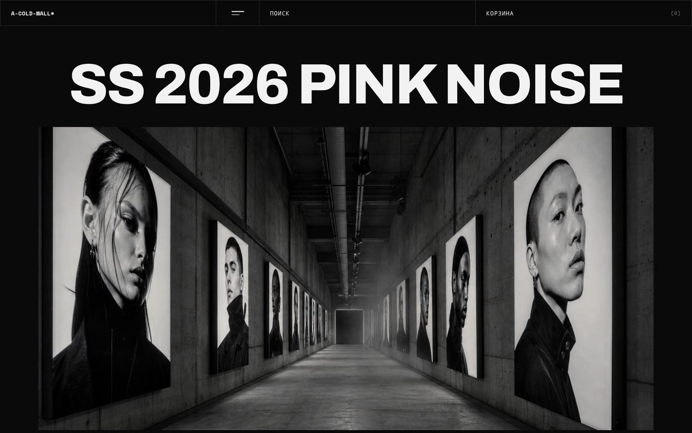

# ACW — концепт-редизайн A-COLD-WALL*

🔗 Демо: https://acw-redesign.vercel.app



## О проекте

Концепт-редизайн витрины британского streetwear-бренда A-COLD-WALL*. Не магазин ради продаж, а высказывание про подачу: индустриальная эстетика, монохром, крупный гротеск Archivo и моноширинный Space Mono в подписях. Цель — показать бренд так, как его читает своя аудитория: бетон, склады, субкультура, ничего лишнего.

Открывает страницу полноэкранный hero «SS 2026 PINK NOISE» — заголовок плакатного размера, под ним кампания-фильм: ряд кадров, постер видео с подписями «Смотреть видео / Звук вкл / На весь экран» и большой коллаж лукбука с реальными кредитами съёмки. Дальше лента ведёт по бренду: новинки едут горизонтальной лентой, которую можно тащить мышью; блок «О бренде», популярные коллаборации (Nike, Dr.Martens), новости таблицей как в архиве, магазины, хиты продаж. Навигация спрятана в полноэкранное меню с нумерацией 01–06.

## Структура проекта

```
acw-design/
├── index.html      # вся разметка: меню-оверлей, хедер, hero, секции, футер
├── style.css       # стили: моно-сетка, типографика Archivo/Space Mono, ховеры
├── main.js         # вся интерактивность (см. ниже)
├── assets/         # 26 изображений: hero, кадры кампании, карточки товаров, магазины
└── preview.jpg     # скриншот главной для превью
```

## Как это работает

Весь JS живёт в `main.js` и собран в одну самовызывающуюся функцию без зависимостей-сборщиков:

- **Плавный скролл** — Lenis (подключён с CDN), с уважением к `prefers-reduced-motion`.
- **Появление блоков** — `IntersectionObserver` навешивает класс `.in` с лёгким стаггером по соседним `.reveal`, плюс страховка-таймаут, чтобы ничего не осталось скрытым.
- **Полноэкранное меню** — оверлей открывается/закрывается, блокирует скролл (`lenis.stop()`), закрывается по Esc и по клику на пункт.
- **Горизонтальная лента товаров** — перетаскивание мышью на `pointer`-событиях (`[data-row]`), без библиотек.

## Стек

HTML / CSS / нативный JS · плавный скролл **Lenis** · reveal на **IntersectionObserver** · шрифты **Archivo** + **Space Mono** (Google Fonts). Сборка не требуется — чистая статика.

## Запуск и деплой

Локально достаточно открыть `index.html`, либо поднять простой сервер:

```bash
python -m http.server 8000
# открыть http://localhost:8000
```

Деплой — статикой на Vercel (демо выше).
